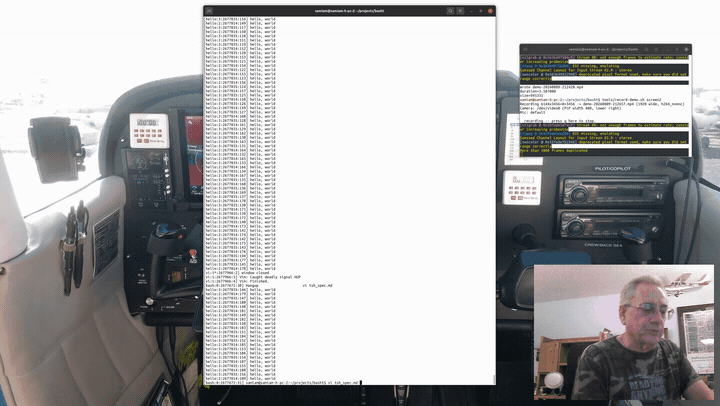

# basht — the multitasking shell

**bash, adapted to a line-multiplexed tagged display.** No task ever writes
to your terminal. Every task — the shell included — writes to its own
pseudoterminals; output reaches the screen as whole lines, each tagged with
who wrote it; and background tasks print *through* the prompt while the line
you are typing survives untouched at the bottom of the screen.

[](https://youtu.be/stjK6rqtQno)

**[▶ Watch the full demo with narration (9 min, YouTube)](https://youtu.be/stjK6rqtQno)**


```
[bash:0:2652461:3] $ test/hello 300 30 &
[bash:0:2652461:4] [1] 2652474
[hello:1:2652474:1] hello, world
[hello:1:2652474:2] hello, world
[bash:0:2652461:5] $ echo typed while it prints     <- your typing survives
[bash:0:2652461:5] typed while it prints
[writer:2:2652489:3] W out 3
[writer:2!:2652489:4] W err 3                       <- stderr, distinctly
[vi:1*:2652500:1] full screen: moved to a window    <- vim gets a window
```

## The tag

Every line is prefixed `[name:n:pid:line]`: the command's name, which
instance of that name this session (`hello:2` is the second hello), the
process id (kill it directly), and the task's own line counter. Marks after
`n`: `!` stderr, `*` shell events. The shell is task 0 — its prompt is just
task 0's unfinished line.

The tag has its own prompt string, `PST1` — the preamble's parallel to
`PS1`, and an ordinary shell variable read afresh for every line. Fields:
`\n` program name, `\i` instance (the stream mark rides just after it),
`\t` task process id, `\l` line number; anything else is literal. The
default is equivalent to

```
PST1='[\n:\i:\t:\l]'
```

`PST1='<\n#\i>'` gives compact tags like `<hello#2>`; `PST1=''` turns
tags off entirely; `unset PST1` restores the default.

## What works

- **Attribution**: concurrent tasks cannot interleave mid-line, ever — the
  kernel sorts their bytes by pty before the shell touches them.
- **Print-through**: background output scrolls above a stable prompt; the
  entry line is erased, the line printed, your typing redrawn beneath.
- **Input follows the console**: a task that prompts — writes a line it
  doesn't finish — owns the console and receives the keyboard, foreground
  or background. Typing continues its line exactly as echo on a shared
  terminal; Enter ships the typed part to its stdin and completes the
  line. When it finishes its line, the console reverts to the shell and
  any half-typed input becomes type-ahead at the prompt.
- **The relay follows the task's own line discipline**: basht reads each
  task's stdin termios off its pty. Canonical readers (`fgets`, `read`)
  get the edited line relay above; a task that goes raw — nested shells,
  `ssh`, `sudo -i`, every readline REPL (`python`, `gdb`, `psql`) — gets
  keystrokes passed straight through, so its own editing, history, and
  completion work natively, painted by its own echo. A sole command owns
  its pty as controlling terminal, so `/dev/tty` resolves to it — pagers
  (`man`, `less`) and password prompts (`ssh`, `sudo`) work on the
  console. Keystrokes go to whichever of the task's ptys it is actually
  reading: `less` takes its keyboard from the stderr device (`ttyname(2)`),
  which under basht is a separate pty, so the relay follows the one the
  task put into raw mode. Note that `less` (and so `man`) enables the
  alternate screen at startup, the same tell as `vim`, so it is moved to a
  window; `export MANPAGER='less -X'` (or `LESS=-RX`) keeps pages on the
  console, where they read like `more`. A nested basht detects the outer
  one and runs plain rather than double-multiplexing.
- **Alt-Left/Right cycles the inputting tasks**: every task currently
  mid-line, the shell included, in a ring — at the prompt and during a
  foreground command alike (the foreground task is always in the ring).
  At the prompt, selection is just a forced instance of the ownership
  rule — the next task to prompt takes the console back. A task you
  cycle away from keeps its half-typed input line and shows it again
  when reselected; the text expires into the shell's command line only
  when the task exits or finishes its output line. During a foreground
  command the selection holds until the selected task goes away;
  selecting the shell there turns typing into a visible type-ahead line
  for the next prompt — Up/Down browse the shell history on it, and
  Enter queues the line to run when the prompt returns.
- **Serial foreground**: a command run without `&` takes the console like
  stock bash; typing relays to its stdin, `^C`/`^Z` are delivered by
  process group, and background tasks keep printing through the whole
  time.
- **`feed name[:n] text...`**: one line into a background task's stdin
  without foregrounding it. (The tsh design calls this `in`, which is a
  bash reserved word.)
- **`clear` is a builtin**: clearing the shared console is the
  operator's decision, so basht performs it directly (`-x` keeps the
  scrollback). Tasks cannot clear the screen — escape sequences in task
  output never reach the terminal, and that includes `clear` run in the
  background.
- **`task 0` / `task 1`**: turn tasking mode off and back on (bare `task`
  reports which it is). Off, basht is stock bash — jobs inherit the real
  terminal, output arrives unfiltered and untagged, foreground jobs take
  the terminal the usual way. The shell's own pty is kept across the
  change, so tags pick up their numbering where they left off. Turning it
  off is refused while tasks are running: nothing would drain their ptys.
- **`term [command ...]`**: open a terminal window running a command —
  `term bash` gets you plain bash in a new window, bare `term` your
  `$SHELL`. The emulator is picked the same way the auto-window picks it
  (`$BASHT_TERMINAL`, else the first one on `PATH`), arguments are passed
  through without re-parsing, and the window is detached: its own
  session, not a task, nothing on the tagged console.
- **Full-screen programs get a window**: a task that enables the alternate
  screen (vim, less, htop) is detected at its first escape and moved into
  its own terminal window automatically — the console never stops
  multiplexing. Set `$BASHT_TERMINAL` to choose the terminal
  (default `gnome-terminal --`).
- **Line-ending tolerance**: the parser accepts crlf, lfcr, bare cr, and
  bare lf as one line ending, from any input source. DOS-encoded scripts
  just run.

## Building

Standard bash build:

```
./configure && make          # add --enable-static-link for a static binary
./basht                      # an interactive shell brings up the multiplexer
```

Non-interactive shells and scripts are untouched: `bash -c`, cron jobs and
`#!` scripts behave exactly like stock bash.

## Reading

- [`doc/basht.1`](doc/basht.1) — the man page for the basht additions
  (`man basht` after install; everything inherited is in `man bash`)
- [`basht.theops`](basht.theops) — theory of operation (start here)
- [`tsh_spec.md`](tsh_spec.md) — the original design specification
- [`basht_plan.md`](basht_plan.md) — the analysis of adapting bash
  (11 files, +1887/−21 against upstream; ~1700 of that in new
  self-contained modules)
- [`mtsh/`](mtsh/) — the standalone prototype shell the model was proven
  in first; it remains the living spec for display behavior
- [`tools/record-demo.sh`](tools/record-demo.sh) — the screen + webcam
  recorder the demo was made with

## Limitations (v1)

Line-oriented commands are the point; full-screen programs belong in their
windows. Pipeline stdin relay
goes to the last stage; task ids are basht's own, not bash's `%n` job
numbers; very long entry lines wrap and erase imperfectly. Nested shells
run without job control (bash locates its job-control tty through stderr,
which is a separate capture pty) — a shell that needs it belongs in a
window.

## License

basht is a modification of GNU bash and is distributed under the same
terms, GPLv3 (see [COPYING](COPYING)). Based on bash-5.3 from GNU savannah.
